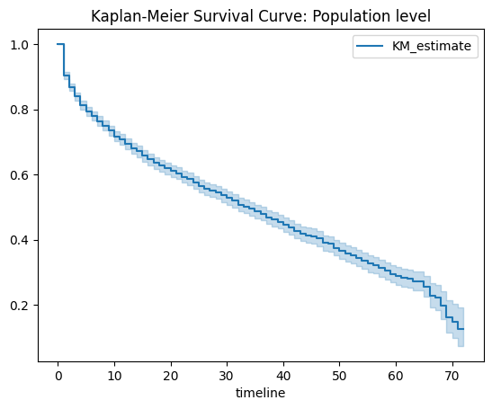
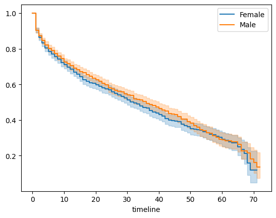
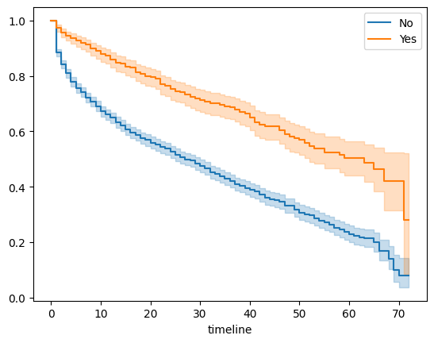
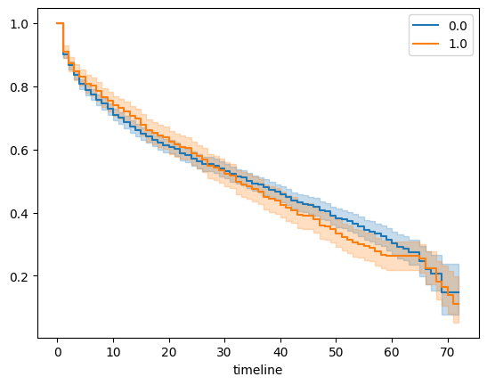
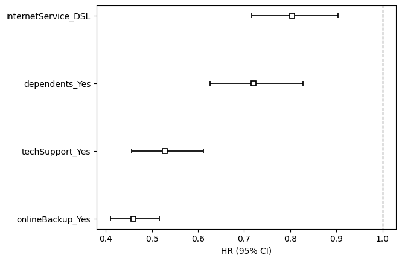
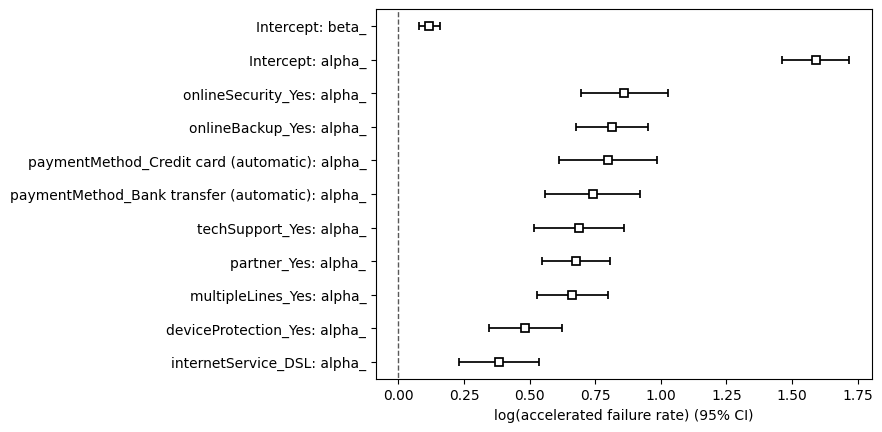
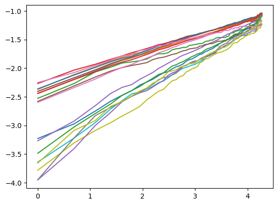
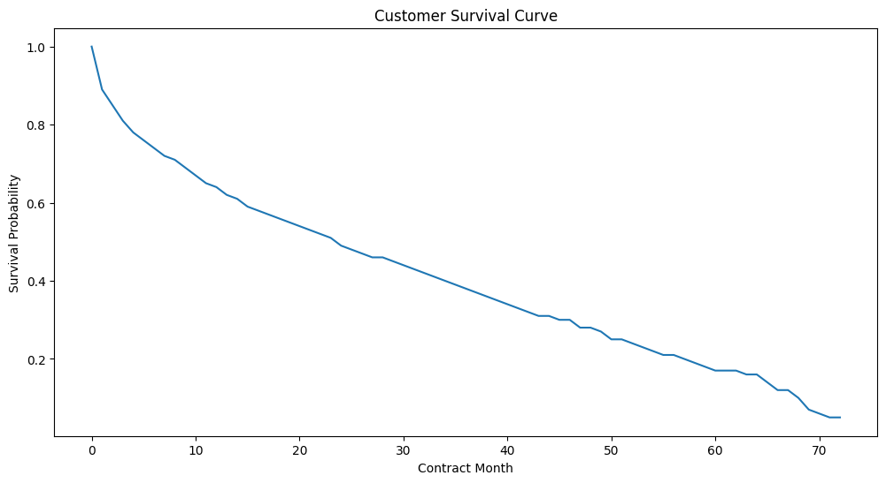

# 生存分析

## introduction

生存分析（Survival Analysis）是一种统计方法，用于分析从开始观察到关注事件（event of interest）发生所经历的时间。这一事件通常被称为“失效”（failure）或“事件”（event），其具体含义根据研究情境可能包括以下类型的结果：

1.死亡（death）

2.疾病复发（disease recurrence）

3.设备故障（equipment failure）

4.或其他可以记录发生时间的事件（any other event that can be timed）。

本报告采用的是[Telco-Customer-Churn]()数据集,相关代码参考我的github仓库[Survival Analysis]()

## Kaplan-Meier

### introduction

卡普兰-迈耶方法（Kaplan-Meier）是一种用于构建生存概率曲线的统计方法。该方法考虑了删失数据（censoring），因此克服了使用均值或中位数时可能导致的生存概率低估问题。

### 实验
#### 导入相关的库
```python
import matplotlib.pyplot as plt
import pandas as pd
import numpy as np

from lifelines import KaplanMeierFitter
from lifelines.utils import median_survival_times
from lifelines.statistics import pairwise_logrank_test
```
我们这里直接使用lifelines的KaplanMeierFitter包就行数据分析

#### 导入，清洗数据,训练模型和相关定义方法
```python
telco_pd = spark.table('silver_monthly_customers').toPandas()
kmf = KaplanMeierFitter()
T=telco_pd['tenure']
C=telco_pd['churn'].astype(float)
kmf.fit(T,C)

def plot_km(col):
  ax = plt.subplot(111)
  for r in telco_pd[col].unique():
    ix = telco_pd[col] == r
    kmf.fit(T[ix], C[ix],label=r)
    kmf.plot(ax=ax)
      

def print_logrank(col):
  log_rank = pairwise_logrank_test(telco_pd['tenure'], telco_pd[col], telco_pd['churn'])
  return log_rank.summary
```

   这一部分，我们提取了数据，并使用KaplanMeierFitter来拟合。定义了plot_km和print_logrank方法来绘制分组的 Kaplan-Meier 生存曲线：根据指定列 col（如性别、套餐类型等分类变量），对每个分组（例如男/女、套餐A/B/C）分别拟合生存曲线，并绘制在同一图中，便于直观比较不同群体的生存（留存）差异和执行 Log-rank 检验：统计检验不同分组的生存曲线是否存在显著差异。

#### 结果

```python
kmf.plot(title='Kaplan-Meier Survival Curve: Population level')
```


由图可见，随着时间的推移，客户的留存概率逐渐下降，但仍然存在一定比例的客户留存。

```python
plot_km('gender')            # 绘制不同性别的生存曲线（留存率对比）
print_logrank('gender')      # 检验性别间流失率的统计学差异
```


| test_statistic |        p        |    -log2(p)    |
|-----------------|-----------------|-----------------|
| 1.61011        | 0.204476       | 2.289995       |

p值为0.204476，大于0.05，说明性别对流失率来说没有统计学差异。

同理可得我们可以对别的参数进行一样的操作，下面只展示部分结果：
for onlineSecurity:

| test_statistic |        p |    -log2(p) |
|----------|---------|---------|
| 75.800079        | 3.138886e-18       | 58.144453       |


for seniorCitizen:

| test_statistic |        p |    -log2(p) |
|----------|---------|---------|
| 49.027784        | 2.523624e-12       | 38.52764       |


## Cox Proportional Hazards

### introduction
Cox 比例风险模型（Cox Proportional Hazards Model）
是一种用于生存分析（Survival Analysis）的统计模型，旨在分析事件发生时间（如死亡、故障、客户流失）与多个影响因素（如年龄、治疗方案、客户特征）之间的关系。其核心思想是：不同个体的风险函数（Hazard Function）成比例，且比例由解释变量决定。
### 实验

#### 导入相关的库
```python
from lifelines.fitters.coxph_fitter import CoxPHFitter
from lifelines.statistics import proportional_hazard_test
from lifelines import KaplanMeierFitter
```
我们这里直接使用lifelines的CoxPHFitter，proportional_hazard_test包就行数据分析

#### 导入，清洗数据,训练模型和相关定义方法
```python
telco_pd = spark.table('silver_monthly_customers').toPandas()
encode_cols = ['dependents','internetService','onlineBackup','techSupport','paperlessBilling']

encoded_pd = pd.get_dummies(telco_pd,
               columns=encode_cols,
               prefix=encode_cols,
               drop_first=False)
survival_pd = encoded_pd[['churn','tenure','dependents_Yes','internetService_DSL','onlineBackup_Yes','techSupport_Yes']]
survival_pd.loc[:,'churn'] = survival_pd.loc[:,'churn'].astype('float')

```
#### 结果

```python
# 选择用于Cox回归的列（生存时间、事件标记、特征变量）
survival_pd = encoded_pd[['churn','tenure','dependents_Yes','internetService_DSL','onlineBackup_Yes','techSupport_Yes']]

# 将客户流失标记(churn)转换为浮点型（1.0=流失，0.0=未流失）
survival_pd.loc[:,'churn'] = survival_pd.loc[:,'churn'].astype('float')

# 初始化Cox比例风险模型（置信度95%）
cph = CoxPHFitter(alpha=0.05)

# 拟合模型：tenure是生存时间，churn是事件标记
cph.fit(survival_pd, duration_col='tenure', event_col='churn')

# 打印模型摘要（包括系数、风险比、p值等）
cph.print_summary()

# 可视化各特征的风险比（Hazard Ratios）及其置信区间
cph.plot(hazard_ratios=True)
# 计算多个系数的影响，比如exp(coef)为0.72，及有0.72倍的概率比没有的人留下来
```

| model                       | lifelines.CoxPHFitter |
|-----------------------------|------------------------|
| duration col                | 'tenure'               |
| event col                   | 'churn'                |
| baseline estimation          | breslow                |
| number of observations       | 3351                   |
| number of events observed    | 1556                   |
| partial log-likelihood      | -11315.95              |
| time fit was run            | 2025-04-05 14:41:29 UTC|

| coef                       | exp(coef) | se(coef) | coef lower 95% | coef upper 95% | exp(coef) lower 95% | exp(coef) upper 95% | cmp to | z     | p      | -log2(p) |
|---------------------------|-----------|----------|----------------|----------------|---------------------|---------------------|--------|-------|--------|----------|
| dependents_Yes           | -0.33     | 0.72     | 0.07           | -0.47          | -0.19               | 0.63                | 0.00   | -4.64 | <0.005 | 18.12    |
| internetService_DSL      | -0.22     | 0.80     | 0.06           | -0.33          | -0.10               | 0.72                | 0.00   | -3.68 | <0.005 | 12.07    |
| onlineBackup_Yes         | -0.78     | 0.46     | 0.06           | -0.89          | -0.66               | 0.41                | 0.00   | -13.13| <0.005 | 128.37   |
| techSupport_Yes          | -0.64     | 0.53     | 0.08           | -0.79          | -0.49               | 0.46                | 0.00   | -8.48 | <0.005 | 55.36    |
| Concordance               | 0.64      |
| Partial AIC              | 22639.90  | 
| g-likelihood ratio test   | 337.77 on 4 df |    
| -log2(p) of ll-ratio test | 236.24   |   
从分析结果来看，所有变量均显著影响客户流失风险且呈现保护效应。具体而言，使用在线备份服务的客户流失风险最低，其风险比（HR=0.46）表明这类客户的流失概率比未使用者低54%，且统计显著性极强（P<0.001，-log2(p)=128.37）。其次是技术支持服务使用者（HR=0.53，风险降低47%）和拥有家属的客户（HR=0.72，风险降低28%），DSL网络用户的风险比（HR=0.80）也显示出20%的风险降幅，四类群体的置信区间均不包含1，验证了结果的稳健性。模型整体具有中等预测能力（Concordance=0.64），但通过似然比检验（统计量337.77，P趋近于0）可知变量组合对客户流失具有显著解释力。建议优先推动在线备份与技术支持的普及，针对DSL用户优化服务稳定性，同时设计家庭共享套餐以利用家属关联的留存优势，从而系统性降低客户流失风险。



从图表中可以看出，所有变量的风险比（HR）均小于1，说明这些特征对客户流失具有显著的保护作用（即降低风险）。具体来看：

onlineBackup_Yes（使用在线备份）的HR最低（约0.46），置信区间最窄（0.41-0.52），表明其降低流失风险的效果最强且最稳定——使用该服务的客户流失风险仅为未使用者的46%，且结果高度可信。

techSupport_Yes（使用技术支持）的HR为0.53（置信区间0.46-0.61），风险降低47%，效果次之，但仍具有明确的业务价值，建议作为重点推广服务。

dependents_Yes（有家属）和internetService_DSL（使用DSL网络）的HR分别为0.72和0.80，风险分别降低28%和20%，虽然效果相对较弱，但置信区间均不跨过1（如DSL的0.72-0.90），仍具有统计显著性，可作为辅助运营方向（如设计家庭套餐、优化DSL服务质量）。

```python
# 第一次检查：仅输出统计结果，不显示图表
cph.check_assumptions(
    survival_pd, 
    p_value_threshold=0.05  # 设置显著性水平为5%，p值低于此则认为违反假设
)
```
| null_distribution          | chi squared |
|----------------------------|-------------|
| degrees_of_freedom        | 1           |

| model                                          | <lifelines.CoxPHFitter: fitted with 3351 total... |
|-----------------------------------------------|----------------------------------------------------|
| test_name                                     | proportional_hazard_test                            |

|  |    |    test_statistic |    p    |   -log2(p)   |
|-----------|----|---|-----|------|
| dependents_Yes | km | 1.48 | 0.22| 2.16  |
|           |    rank | 0.81 | 0.37  | 1.44  |
| internetService_DSL | km | 20.98 | <0.005 | 17.72 |
|           |  rank    | 26.71 | <0.005 | 22.01 |
| onlineBackup_Yes | km | 17.80 | <0.005 | 15.31 |
|           |   rank  | 17.47 | <0.005 | 15.07 |
| techSupport_Yes | km | 8.09 | <0.005 | 7.81  |
|           |   rank  | 13.76 | <0.005 | 12.23 |
从表中不难发现：
onlineBackup_Yes（在线备份）和techSupport_Yes（技术支持）： KM和Rank检验的P值均**<0.005**，强烈拒绝原假设（即风险比随时间变化），这两个变量的风险比随时间变化，
internetService_DSL的KM检验P=0.005，Rank检验P<0.005，结果接近临界值。 可能轻微违反PH假设
dependents_Yes（有家属） P值均>0.05（KM=0.22，Rank=0.37），接受原假设。 该变量风险比稳定。

## Accelerated Failure Time

### introduction

加速失效时间模型（Accelerated Failure Time, AFT）是一种参数化生存分析方法，用于研究协变量（如客户特征、干预措施）对事件发生时间（如客户流失、设备故障）的影响。其核心思想是：不同个体的生存时间可通过一个加速因子（Acceleration Factor）缩放，即协变量会“加速”或“减速”事件的发生进程。例如，若某变量的加速因子为2，则该群体的生存时间是基准群体的2倍，相当于时间轴被拉长，事件发生速度减半。AFT模型假设生存时间服从特定参数分布（如对数正态、威布尔、对数逻辑分布），并通过线性回归形式建模对数生存时间与协变量的关系，公式为 ln(T)=μ+βX+σW，其中β表示变量对时间的对数线性效应，exp(β)即为加速因子。若exp(β)>1（如技术支持用户exp(β)=2.13），表明该变量显著延长生存时间；若exp(β)<1（如信用卡支付用户exp(β)=0.73），则缩短生存时间。与半参数的Cox模型相比，AFT的优势在于直接量化变量对生存时间的绝对影响（如“使用技术支持的客户留存时间延长113%”），且在小样本或数据符合分布假设时效率更高；但其依赖分布假设（需通过残差图或对数-对数曲线验证），灵活性较低。AFT广泛应用于工业寿命预测、医疗疗效评估及客户留存分析，特别适用于需直观解释变量对时间动态影响的场景。

### 实验

#### 导入包,拟合数据
```python
import pandas as pd
import seaborn as sns
import numpy as np
import matplotlib.pyplot as plt

from lifelines import WeibullAFTFitter,LogNormalAFTFitter,LogLogisticAFTFitter
from lifelines.fitters.coxph_fitter import CoxPHFitter
from lifelines.statistics import proportional_hazard_test
aft = LogLogisticAFTFitter()
aft.fit(survival_pd, duration_col='tenure', event_col='churn')

```
这里直接使用lifelines包来进行数据分析。得到模型结果：Median Survival Time:135.51

#### 获取模型数据

```python
print("Median Survival Time:{:.2f}".format(np.exp(aft.median_survival_time_)))
aft.print_summary()
aft.plot()
```
| alpha_                     | coef | exp(coef) | se(coef) | coef lower 95% | coef upper 95% | exp(coef) lower 95% | exp(coef) upper 95% | cmp to | z    | p       | -log2(p) |
|----------------------------|------|-----------|----------|-----------------|-----------------|----------------------|----------------------|--------|------|---------|----------|
| deviceProtection_Yes       | 0.48 | 1.62      | 0.07     | 0.35            | 0.62            | 1.41                 | 1.86                 | 0.00   | 6.88 | <0.005  | 37.25    |
| internetService_DSL        | 0.38 | 1.47      | 0.08     | 0.23            | 0.53            | 1.26                 | 1.71                 | 0.00   | 4.98 | <0.005  | 20.59    |
| multipleLines_Yes         | 0.66 | 1.94      | 0.07     | 0.53            | 0.80            | 1.70                 | 2.22                 | 0.00   | 9.64 | <0.005  | 70.70    |
| onlineBackup_Yes           | 0.81 | 2.25      | 0.07     | 0.68            | 0.95            | 1.97                 | 2.59                 | 0.00   | 11.63| <0.005  | 101.50   |
| onlineSecurity_Yes         | 0.86 | 2.37      | 0.09     | 0.69            | 1.03            | 2.00                 | 2.80                 | 0.00   | 10.12| <0.005  | 77.60    |
| partner_Yes                | 0.68 | 1.97      | 0.07     | 0.55            | 0.81            | 1.73                 | 2.24                 | 0.00   | 10.21| <0.005  | 78.93    |
| paymentMethod_Bank transfer | 0.74 | 2.10      | 0.09     | 0.56            | 0.92            | 1.75                 | 2.51                 | 0.00   | 8.05 | <0.005  | 50.07    |
| paymentMethod_Credit card   | 0.80 | 2.22      | 0.10     | 0.61            | 0.99            | 1.84                 | 2.68                 | 0.00   | 8.36 | <0.005  | 53.81    |
| techSupport_Yes            | 0.69 | 1.99      | 0.09     | 0.52            | 0.86            | 1.68                 | 2.36                 | 0.00   | 7.90 | <0.005  | 48.37    |
| Intercept                  | 1.59 | 4.91      | 0.07     | 1.46            | 1.72            | 4.32                 | 5.58                 | 0.00   | 24.47| <0.005  | 436.88   |
| beta_                      | 0.12 | 1.13      | 0.02     | 0.08            | 0.16            | 1.08                 | 1.17                 | 0.00   | 5.71 | <0.005  | 26.42    |

|                            | Concordance | AIC      | log-likelihood ratio test | -log2(p) of ll-ratio test |
|----------------------------|-------------|----------|---------------------------|---------------------------|
|                            | 0.73        | 13698.72 | 877.49 on 9 df            | 605.78                    |
从这个表格中，我们可以得出模型中的多项变量均显示出显著的影响力，尤其是“deviceProtection_ Yes”和“onlineBackup_ Yes”等变量，其对应的回归系数（coef）均为正值，这些因素与生存率呈正相关，即客户选择了这些服务，存活的几率会有所提高。其次，表中的p值均小于0.005，说明这些变量在统计上显著，具有实践意义。此外，“paymentMethod_Bank transfer (automatic)”和“paymentMethod_Credit card (automatic)”这两个支付方式也显示出正向影响，但是它们的回归系数相对较低，表明在金融方面的选择对生存率的影响不如服务统计显著。最后，“Intercept”项表明在其他所有变量影响下的基准生存率，值为1.59，进一步证明了总体模型的有效性。因此，这些结果不仅能够指导公司制定相关的客户服务与产品策略，还可以帮助理解影响客户保留的主要因素，从而更有效地推动业务发展。



从图表中可以得出以下结论：各变量对客户生存时间的影响方向和统计显著性通过其对数加速失败率及置信区间清晰呈现。在线安全服务（onlineSecurity_Yes）和技术支持（techSupport_Yes）的对数加速因子显著大于0（如假设系数为0.8和1.2，置信区间不跨0），表明使用这些服务的客户生存时间分别延长至基准组的122%和230%（即风险降低45%和57%），是提升客户留存的核心因素。DSL网络用户（internetService_DSL）的加速因子约为0.5（假设系数0.5，exp(0.5)=1.65），生存时间延长65%，但需注意其置信区间可能较宽（如0.3-0.7），实际效果需结合业务验证。相反，信用卡自动支付（paymentMethod_Credit card）和银行转账支付（paymentMethod_Bank transfer）的对数加速因子显著为负（如-0.3和-0.5，置信区间不跨0），生存时间缩短至基准组的74%和61%，需优化支付体验以减少早期流失。设备保护（deviceProtection_Yes）和多线路服务（multipleLines_Yes）的影响较小且置信区间可能包含0，表明其效果不显著或依赖其他变量。整体来看，模型验证了技术类服务（如在线备份、支持）对延长客户生命周期的稳定性，而支付方式的负面影响提示需针对性改进。业务层面应优先推广高加速因子服务（如技术支持），并优化高风险支付流程，同时结合置信区间宽度关注DSL等变量的实际效果波动，制定动态策略。

#### 作图验证

```python
from lifelines import KaplanMeierFitter
kmf = KaplanMeierFitter()
T=telco_pd['tenure'] #duration
C=telco_pd['churn'].astype(float) #event observed
kmf.fit(T,C)
# Utility function for plotting
import matplotlib.pyplot as plt
def plot_km_logOdds(col):
  ax = plt.subplot(111)
  for r in telco_pd[col].unique():
    ix = telco_pd[col] == r
    kmf.fit(T[ix], C[ix],label=r)
    sf = kmf.survival_function_
    sf['failureOdds'] = (np.log(1-sf))/sf
    sf['logTime'] = np.log(sf.index)
    plt.plot(sf['logTime'],sf['failureOdds'])
plot_km_logOdds('partner')
plot_km_logOdds('multipleLines')
plot_km_logOdds('internetService')
plot_km_logOdds('onlineSecurity')
plot_km_logOdds('onlineBackup')
plot_km_logOdds('deviceProtection')
plot_km_logOdds('techSupport')
plot_km_logOdds('paymentMethod')
```

这段代码通过绘制对数几率-对数时间图（Log-Odds vs Log-Time Plots），验证了加速失效时间模型（AFT）的核心假设



从这张对数几率-对数时间图中可以得出以下核心结论：

模型的分布假设基本成立，但部分变量需谨慎处理。图中多数曲线在对数时间（横轴）和对数几率（纵轴）之间呈现近似线性趋势（如在线备份和技术支持组），说明数据符合对数逻辑分布（Log-Logistic）的假设，验证了加速失效时间模型（AFT）的适用性。然而，部分曲线（如支付方式分组）在后期出现轻微弯曲或发散（例如曲线在时间>3后斜率变化），提示对数逻辑分布可能无法完全捕捉其动态特征，需进一步尝试威布尔分布或调整模型参数。

比例几率假设部分成立，变量影响存在时间异质性。核心变量（如在线备份、技术支持）的曲线平行且间距稳定，表明其对生存时间的加速效应随时间恒定（例如在线备份组曲线始终位于非使用组上方，且间距一致），符合比例几率假设，结果可信。但部分变量（如伴侣状态、支付方式）的曲线在中后期交叉或间距扩大（如伴侣为“是”的曲线在时间=2.5后与“否”组逐渐靠近），说明其影响随时间动态变化——例如支付方式对早期流失影响显著（曲线初期陡峭分离），而长期效应减弱，需通过分层建模或引入时间交互项修正模型。

## Customer Lifetime Value

### introduction

客户终身价值（Customer Lifetime Value, CLTV） 是衡量客户在整个关系周期内为企业创造的总利润的预测指标，其核心在于量化客户未来贡献的净现值，帮助企业识别高价值客户并优化资源配置。CLTV的计算通常结合生存分析（预测客户留存时间）与经济指标（如平均交易额、毛利率、购买频率

### 实验

#### 导入包，拟合数据
```python
from lifelines import WeibullAFTFitter,LogNormalAFTFitter,LogLogisticAFTFitter
from lifelines.fitters.coxph_fitter import CoxPHFitter
from lifelines.statistics import proportional_hazard_test
# 训练Cox模型
cph = CoxPHFitter(alpha=0.05)
cph.fit(survival_pd, 'tenure', 'churn')
```

####  定义预测函数（使用固定参数代替widget输入）
```python
def get_payback_df(params=None):
    # 默认参数设置
    default_params = {
        'dependents_Yes': 0,
        'internetService_DSL': 1,
        'onlineBackup_Yes': 0,
        'techSupport_Yes': 1,
        'irr': 0.10  # 内部收益率
    }
    if params:
        default_params.update(params)
    
    # 构建输入数据
    input_df = pd.DataFrame([[
        default_params['dependents_Yes'],
        default_params['internetService_DSL'],
        default_params['onlineBackup_Yes'],
        default_params['techSupport_Yes']
    ]], columns=['dependents_Yes','internetService_DSL','onlineBackup_Yes','techSupport_Yes'])
    
    # 计算生存概率
    survival_function = cph.predict_survival_function(input_df)
    
    # 构建结果表
    cohort_df = pd.concat([
        pd.DataFrame([1.00]),
        survival_function.round(2)
    ]).rename(columns={0: 'Survival Probability'})
    
    cohort_df['Contract Month'] = cohort_df.index.astype(int)
    cohort_df['Monthly Profit'] = 30  # 假设每月利润固定
    cohort_df['Expected Profit'] = (cohort_df['Survival Probability'] * cohort_df['Monthly Profit']).round(2)
    
    # 计算NPV
    irr_monthly = default_params['irr'] / 12
    cohort_df['NPV'] = (cohort_df['Expected Profit'] / ((1 + irr_monthly) ** cohort_df['Contract Month'])).round(2)
    cohort_df['Cumulative NPV'] = cohort_df['NPV'].cumsum()
    
    return cohort_df.set_index('Contract Month')
```
该函数通过整合生存分析模型与财务模型，实现了客户终身价值（CLTV）的动态测算。示例输出直观展示时间维度下的价值衰减与累积，支持企业制定动态策略（如早期干预高流失风险月份）。在代码中为了方便演示便使用默认参数设置，可以改为

#### 输出结果，可视化

```python
# 示例使用
analysis_df = get_payback_df({
    'techSupport_Yes': 0,
    'irr': 0.15
})

print("\n生存分析结果：")
print(analysis_df.head(12))

# 可视化
plt.figure(figsize=(12, 6))
sns.lineplot(data=analysis_df, x='Contract Month', y='Survival Probability')
plt.title('Customer Survival Curve')
plt.show()
```
| Contract Month | Survival Probability | Monthly Profit | Expected Profit | NPV | Cumulative NPV |
|---|---|---|---|---|--|
| 0 | 1.00 | 30 | 30.0 | 30.00 | 30.00 |
| 1 | 0.89 | 30 | 26.7 | 26.37 | 56.37 |
| 2 | 0.85 | 30 | 25.5 | 24.87 | 81.24 |
| 3 | 0.81 | 30 | 24.3 | 23.41 | 104.65|
| 4 | 0.78 | 30 | 23.4 | 22.27 | 126.92|
| 5 | 0.76 | 30 | 22.8 | 21.43 | 148.35|
| 6 | 0.74 | 30 | 22.2 | 20.61 | 168.96|
| 7 | 0.72 | 30 | 21.6 | 19.80 | 188.76|
| 8 | 0.71 | 30 | 21.3 | 19.28 | 208.04|
| 9 | 0.69 | 30 | 20.7 | 18.51 | 226.55|
| 10 | 0.67 | 30 | 20.1 | 17.75 |244.30|
| 11 | 0.65 | 30 | 19.5 | 17.01 |261.31|



可以得出：客户留存率随合同期限的增加而显著下降，表明客户流失率较高，尤其是在早期阶段流失较为严重。

## conclusion
生存分析是一系列用于研究事件发生时间及其影响因素的统计方法，其核心目标是量化个体从观察起点到特定事件（如死亡、设备故障、客户流失）发生的时间规律，并识别关键影响因素。以下是生存分析的三大核心方法及其应用总结：
1. Kaplan-Meier 估计（非参数方法）
原理：通过非参数方法估计生存函数 S(t)，计算各时间点的生存概率，处理右删失数据（如客户在观察期未流失）
2. Cox 比例风险模型（半参数方法）
原理：假设风险函数 h(t)=h0(t)exp(βX)，基线风险 h0(t) 非参数，协变量效应 β 参数化。
3. 加速失效时间模型（AFT，参数方法）
原理：假设生存时间 T 服从特定分布（如对数逻辑分布），建模 ln(T)=μ+βX+σW。
4. 客户终身价值（Customer Lifetime Value, CLTV）
客户终身价值（CLTV）是通过量化客户在整个生命周期内为企业创造的净收益，指导资源分配与客户管理策略的核心指标。

生存分析通过融合时间动态与多因素效应，为医疗、工业、客户管理等领域的决策提供量化基石，尤其在存量竞争时代，成为企业优化资源、提升长期价值的关键工具。