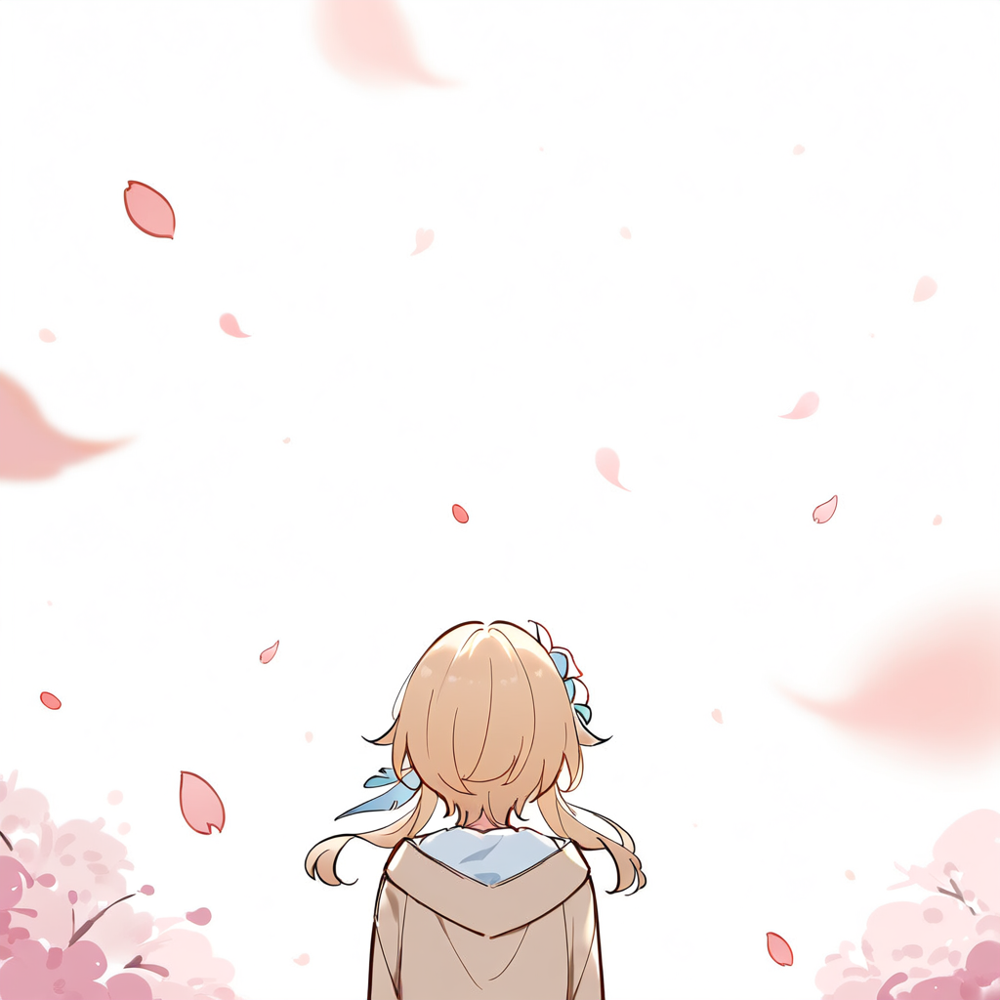

#
## [Estraie的主页](https://Estraie.github.io/)

偶然到访的客人，你好。在漫长的人生旅途中，不妨在我的网站稍作逗留。

我是李乐平。我是一名音乐爱好者，尤其喜欢羽管键琴演奏的古典音乐和古典风格的二次元音乐。假如你对这类音乐有兴趣，不妨尝试在下面列出的部分我所喜爱的作品。

#

Richard Jones
[*Suite for keyboard No. 1 in D minor (Suits or Setts of Lessons for the Harpsichord, 1732): 5. Gavotte*](https://music.163.com/#/song?id=32157712)

葉月ゆら
[*White Princess*](https://music.163.com/#/song?id=541492118)

Ash Blind
[*夜想曲*](https://music.163.com/#/song?id=690183)

HOYO-MiX
[*巧遇的漫想 Romantic Encounter*](https://music.163.com/#/song?id=2613484726)

天門
[*Two, Only Two*](https://music.163.com/#/song?id=527778)

#

我还是一名围棋爱好者，曾经热衷于求解、创作围棋死活题。[我的个人主页](https://Estraie.github.io/)展示了部分我较为满意的作品，欢迎前来游玩。

此外，我十分喜爱二次元风格的动漫和游戏作品，如某科学的超电磁炮、魔女之旅、东方Project、原神、八方旅人2等。这些作品均在我人生的某个阶段给予了我极大的精神支撑。我也希望在今后的旅途中，能够参与、创作给予人精神上快乐的作品。

我即将在[**南方科技大学**](https://sustech.edu.cn/)完成**数据科学与大数据技术**专业的本科学习，并且将于2025~2028年在[**南开大学**](https://www.nankai.edu.cn/)计算机学院的[**媒体计算实验室**](https://mmcheng.net/)修读**计算机科学与技术**专业的硕士学位。我的研究兴趣将包括计算机图形学、物理模拟等。我希望我所学习、研究的知识能为我将来可能从事的开发、创作工作提供不可或缺的帮助。假如你浏览至此处，且能够为我提供较为对口的实习、工作机会，请务必通过我的邮箱[li_leping@qq.com](mailto:li_leping@qq.com)与我联系，十分感谢。

如果我的主页为你的生活带来一丝新鲜感，也欢迎你通过我的邮箱[li_leping@qq.com](mailto:li_leping@qq.com)让我得知，我会十分高兴。

#
## [Estraie's Homepage](https://Estraie.github.io/)

Greetings, chance visitor. In the long journey of life, feel free to linger awhile on my website.

I am LI Leping (李乐平, and LI is my family name). As a music enthusiast, I particularly adore classical music performed on the harpsichord and classically-styled anime music. If these genres interest you, I invite you to explore some of my favorite works listed below.

#

Antonio Lucio Vivaldi
[*Violin Concerto in G Minor, Op. 4 No. 6, RV 316a: I. Allegro*](https://music.163.com/#/song?id=1876344039)

葉月ゆら
[*Nocturne [月の舞踏会]*](https://music.163.com/#/song?id=22644036)

上海アリス幻樂団
[*少女綺想曲 ～ Dream Battle*](https://music.163.com/#/song?id=22636684)

HOYO-MiX
[*花与树的女儿们 Maidens of Sanctity*](https://music.163.com/#/song?id=2041859147)

天門
[*A moon filled sky.*](https://music.163.com/#/song?id=527799)

#

I am also an avid Go (Also known as Weiqi, 围棋) player, once deeply passionate about solving and creating Life and Death problems (Also known as Tsumego, 死活题, 詰碁). A selection of my somewhat satisfying works is displayed on [My Homepage](https://Estraie.github.io/). You’re welcome to visit and engage with them.

Additionally, I greatly enjoy anime and games with a distinctly "2D" (Also known as ACG) aesthetic, such as とある科学の超電磁砲, 魔女の旅々, Touhou Project, Genshin Impact, and Octopath Traveler II. These works have provided immense emotional support during various phases of my life. I aspire to participate in—and eventually create—art that brings similar spiritual joy to others in the future.

I will soon complete my undergraduate studies in [**Southern University of Science and Technology**](https://sustech.edu.cn/) with a major in **Big Data Science and Technology**, and from 2025 to 2028, I will pursue a master’s degree in **Computer Science and Technology** at the **Media Computing Lab** of [**Nankai University**](https://www.nankai.edu.cn/). My research interests include Computer Graphics, Physics-based Simulation, and related fields. I hope the knowledge I gain will become an indispensable foundation for my future endeavors in development and creative projects. If you’ve read this far and can offer internship or career opportunities aligned with my background, please don’t hesitate to contact me via email at [li_leping@qq.com](mailto:li_leping@qq.com). I would be deeply grateful.

If my homepage has added even a small spark of novelty to your day, I’d be delighted to hear from you at [li_leping@qq.com](mailto:li_leping@qq.com).

#
## [Estraie's Homepage](https://Estraie.github.io/)

Greetings to thee, chance-visiting visitor. In life's long peregrination, prithee tarry a while upon mine own digital demesne.

I am LI Leping (李乐平, and LI is my family name). A lover of musick am I, most partial to the harpsichord's baroque strains and anime-styled harmonies in antique manner. Should such airs please thine ear, thou mayst peruse here below a selection of works that I esteem precious.

Johann Sebastian Bach
[*Harpsichord Concerto, Concerto in F Minor, BWV1056*](https://music.163.com/#/song?id=1294413081)

Calvaria
[*Ⅰ. A Stray Child*](https://music.163.com/#/song?id=36103517)

雨宮ゆりの
[*雪空の桜*](https://music.163.com/#/song?id=33544315)

HOYO-MiX
[*命定的离别 Destined Parting*](https://music.163.com/#/song?id=1861578838)

原田ひとみ
[*悠久の翼*](https://music.163.com/#/song?id=4970794)

Moreover, I am a devotee of Go (Also known as Weiqi, 围棋), having erstwhile burnt midnight oil in solving and crafting Life and Death problems (Also known as Tsumego, 死活题, 詰碁). [Mine GitHub page](https://Estraie.github.io/) doth exhibit certain compositions of some contentment - pray visit and disport thyself there.

To anime and games of the two-dimensional realm (Also known as ACG) am I mightily inclined - works such as とある科学の超電磁砲, 魔女の旅々, Touhou Project, Genshin Impact, and Octopath Traveler II have in divers seasons of my life been as staff and sustenance to my spirit. 'Tis my ardent hope that in journeys yet to come, I may both partake in and create works that bring such spiritual nourishment to others.

Ere long shall I complete mine undergraduate studies in **Data Science and Big Data Technology** at [**Southern University of Science and Technology**](https://sustech.edu.cn/), with plans to pursue a Master's degree in **Computer Science and Technology** at [**Nankai University**](https://www.nankai.edu.cn/) University's [**Media Computing Lab**](https://mmcheng.net/) from 2025~2028. Mine academic pursuits shall embrace the art of **Computer Graphics** and **Physics-based Simulation**, which knowledge I pray may prove indispensable to future creative endeavors. Should any reading this have knowledge of apprenticeships or positions meet for my skills, I beseech thee - make haste to contact me via electronic missive at [li_leping@qq.com](mailto:li_leping@qq.com).

If this page hath brought thee any novel delight, 'twould gladden mine heart exceedingly to hear of it through mine email [li_leping@qq.com](mailto:li_leping@qq.com).

